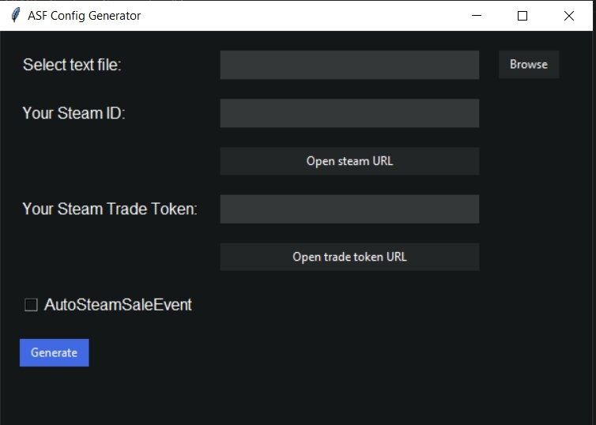

# ASF Config Generator

ASF Config Generator is a Python program that allows you to generate ASF (ArchiSteamFarm) configuration files from a text file containing multiple Steam accounts.

## Features

- Select a text file with Steam account credentials
- Enter your Steam ID and Steam Trade Token
- Enable AutoSteamSaleEvent checkbox if desired
- Click the "Generate" button to generate ASF configuration files for each account

## Requirements

- Python 3.6 or higher
- Tkinter module (usually bundled with Python)

## Usage

1. Clone the repository or download the source code.
2. Install the required dependencies by running `pip install -r requirements.txt`.
3. Place your text file with Steam account credentials in the project directory.
4. Run the program using the following command:
5. In the program window, click the "Browse" button to select the text file.
6. Enter your Steam ID and Steam Trade Token in the respective fields.
7. Check the "AutoSteamSaleEvent" checkbox if you want to enable it.
8. Click the "Generate" button to generate the ASF configuration files.
9. The generated files will be stored in the "results" directory.
10. After the generation process is complete, a success message will be displayed.

## License

This project is licensed under the MIT License. See the [LICENSE](LICENSE) file for details.
